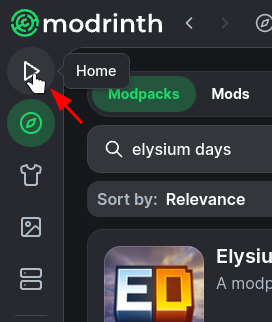
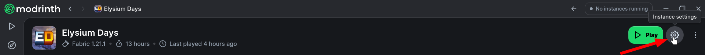
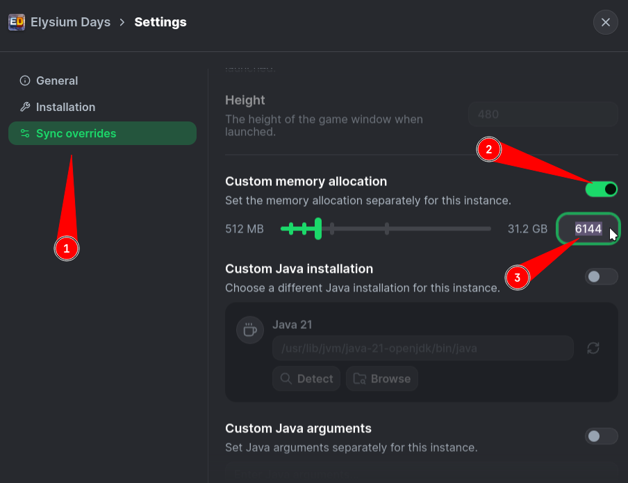
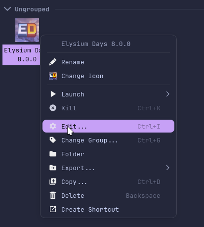
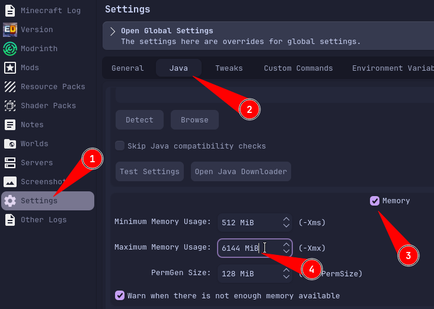
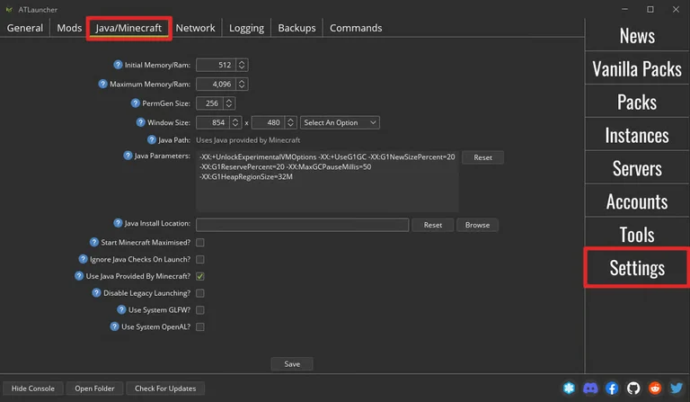

  
🟩 Modrinth App

First make your way up to the `Home` tab then choose your Elysium Days instance.

Visit Instance Settings.

And change memory allocation to minimum `6144 MB (6 GB)`.

***

  
⬜ Prism Launcher

Right click your Elysium Days instance and choose `Edit`.

Then go to settings, then Java, and set the `Maximum Memory Usage` to minimum `6144 MB (6 GB)`.

***

  
⬛ ATLauncher

First click the settings button on the side bar, and visit Java/Minecraft tab.

And change memory allocation to minimum `6144 MB (6 GB)`.

***

  
🟦 GDLauncher

Locate to Settings Wheel, enter the Java tab and make Java Memory to minimum `6144 MB (6 GB)`.

