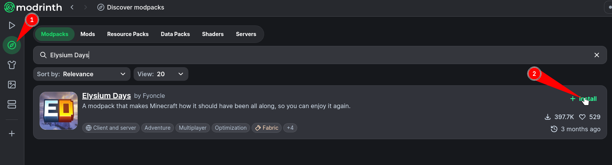
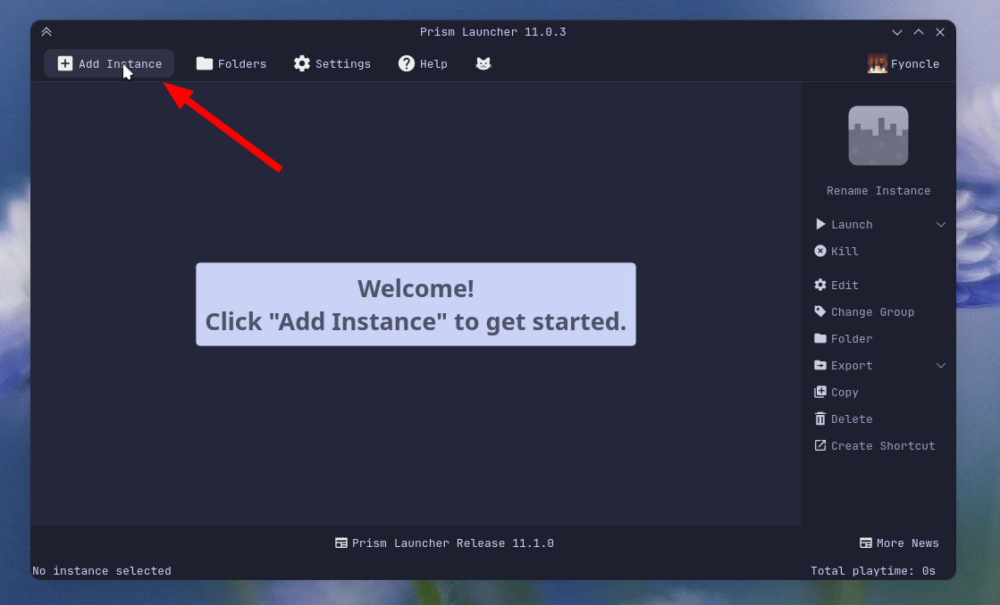
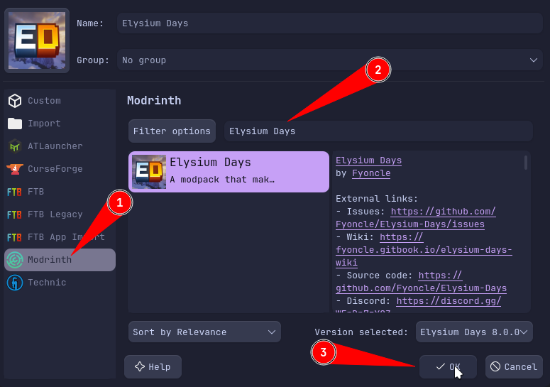

import { Aside, Icon } from "@astrojs/starlight/components";

### <Icon name="download" color="var(--sl-color-text-accent)" /> General Installation

If you're using a launcher that supports Elysium Days like Modrinth or Prism, just search for the modpack's name directly in the launcher.

<Aside type="tip">
  If your launcher, including CurseForge, doesn't support Elysium Days, refer to
  Server Installation of the wiki to get a ZIP version for manual installation.
</Aside>

### <Icon name="window" color="var(--sl-color-text-accent)" /> Launcher-Specific Guides

  
🟩 Modrinth App

First, we are going to the `Discover Content` page.

Now search for **Elysium Days** in the modpacks section and click on `Install`.

---

  
⬜ Prism Launcher

First, we are going to click `➕ Add Instance`.

In this screen, choose Modrinth, and search for **Elysium Days**. Then choose the latest version of the modpack and click `OK`!

---

  
⬛ ATLauncher

Since I don't use this launcher, here is a documentation:

- [How to Play Modpacks with the ATLauncher - Apex Hosting](https://apexminecrafthosting.com/how-to-play-modpacks-with-the-atlauncher/)

---

  
🟦 GDLauncher

Since I don't use this launcher, here is a video:

- [GD Launcher Full Tutorial](https://www.youtube.com/watch?v=WpViOvyu4eE)

---

  
🟫 Minecraft Launcher

This launcher is **not supported** and it's tedious for modded Minecraft.

But if you're that desperate to use it, you can still do it with the Server Installation method.

Though I would recommend you to use any other launcher that's stated above, specially Modrinth App or Prism Launcher.

---

Some parts of this page is borrowed by Optimum Fuse's wiki with permission.

